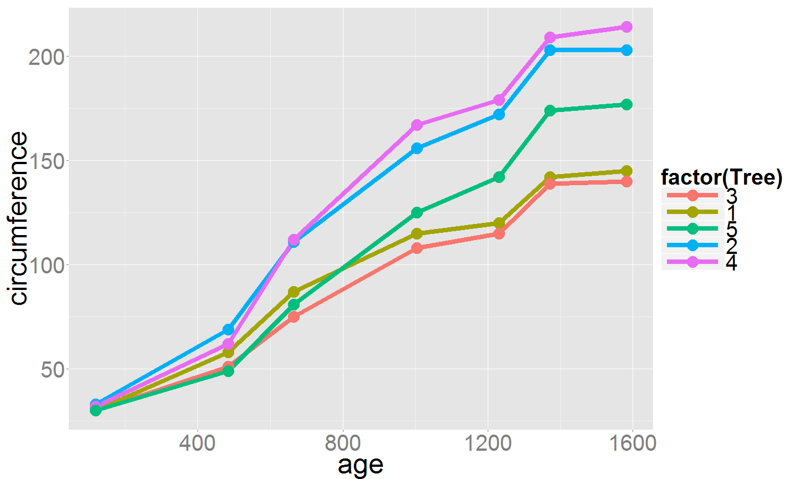

<style>
.small-code pre code {
  font-size: 1.4em;
}
</style>

<style>
.smaller-code pre code {
  font-size: 1.2em;
}
</style>


Introduction to R Programming
========================================================
author: Chia Ying Lee
date: 

What is Exploratory Data Analysis?
========================================================


What is R?
========================================================

<small> R is a computational tool for answering numerical and statistical questions about data.</small>

R is free, open sourced, and has a large community of users.

Motivating Example: what can R do?
========================================================
class: small-code
- Orange tree dataset


```r
library(datasets)
head(Orange, 10)
```

```
   Tree  age circumference
1     1  118            30
2     1  484            58
3     1  664            87
4     1 1004           115
5     1 1231           120
6     1 1372           142
7     1 1582           145
8     2  118            33
9     2  484            69
10    2  664           111
```


Motivating Example: what can R do?
========================================================
class: small-code

- How many data points?

```r
dim(Orange)
```

```
[1] 35  3
```

- How many trees in data set?

```r
unique(Orange$Tree)
```

```
[1] 1 2 3 4 5
Levels: 3 < 1 < 5 < 2 < 4
```


Motivating Example: what can R do?
========================================================
class: small-code
- Circumference of trees at day 1582?

```r
(dat <- dplyr::filter(Orange, age==1582))
```

```
  Tree  age circumference
1    1 1582           145
2    2 1582           203
3    3 1582           140
4    4 1582           214
5    5 1582           177
```

```r
mean(dat$circumference)
```

```
[1] 175.8
```


Motivating Example: what can R do?
========================================================

- Visualize the data
 


========================================================
## Basics of R


Data Types in R
========================================================

- Every variable must be of a data type.
- Base R data types:
  - integer
  - numeric
  - character (a.k.a string)
  - list
  - data.frame
  - and more!
- Data types can be customized.


Creating objects in R
========================================================
class: small-code

- Explicit assignment `<-`

```r
x <- 5L                     # integer scalar
y <- c(1, 2.71, 5.5)   # numeric vector

z <- list("orange", pi, y) # list of character and numeric types
```
    


```r
# R Shortcuts
oneThroughFive <- 1:5
tenZeros <- rep(0, 10)
```

- Read data from csv file 

```r
dat <- read.csv("./data/Titanic.csv")
```


What data type?
========================================================
class: small-code
- Use the `class` function to determine the data type

```r
class(x)
```

```
[1] "integer"
```

```r
class(y)
```

```
[1] "numeric"
```

- `y` is in fact a vector with 3 entries

```r
length(y)
```

```
[1] 3
```

What data type?
========================================================
<font color="blue">Exercise: In the RStudio console, find the class of `z` and `dat`.</font>

Viewing the data
========================================================
class: small-code
- Print to console with the `print` function

```r
print(x)
```

```
[1] 5
```

- If working from the console, `print` is not needed

```r
oneThroughFive
```

```
[1] 1 2 3 4 5
```


Viewing the data
========================================================
<font color="blue">Exercise: print `y` and `z` to console. What do you make of them? </font>


Accessing the data
========================================================
class: small-code

- Access vector entry with `[ ]`

```r
y[2]    # 2nd entry
```

```
[1] 2.71
```

- Access multiple entries

```r
y[ c(1,3) ]  # 1st and 3rd entries
```

```
[1] 1.0 5.5
```
  Breakdown: `c(1,3)` concatenates the entries into a vector, which is then fed into `y[ ]`.

Accessing the data
========================================================
class: small-code
- Access a list entry with `[[ ]]`

```r
z[[1]]  # 1st list entry
```

```
[1] "orange"
```

```r
z[[3]]  # 3rd list entry
```

```
[1] 1.00 2.71 5.50
```


Using the data
========================================================
class: small-code
- Use in an _expression_

```r
# pi * r^2, area of circle of radius r=1
z[[2]] * y[1]^2  
```

```
[1] 3.141593
```


<font color="blue">
Exercise: 

1. Create a variable named `area` with the value of the area.
- Find the areas of the circles of radii equal to the entries of `y`. 
- Bonus: create a vector named `areas` containing the areas.

</font>

Bonus solution
========================================================
class: small-code
- Solution 1

```r
areas <- c(pi * y[1], 
           pi * y[2], 
           pi * y[3])
print(areas)
```

```
[1]  3.141593  8.513716 17.278760
```
- Solution 2

```r
areas <- pi * y
print(areas)
```

```
[1]  3.141593  8.513716 17.278760
```


Functions and objects
========================================================

- We have seen the *functions* `class`, `print`, `c`, `rep`, `read.csv`.

- Usage of functions take a particular format:
  
  (A picture to highlight function syntax with round brackets and one or more arguments)

- Distinguish from subsetting variables using square brackets.


Functions and objects: error messages
========================================================
class: small-code
- Trying to subset a function

```r
class[1]
```

```
<simpleError in class[1]: object of type 'builtin' is not subsettable>
```

- Trying to give inputs to a data vector

```r
y(1)
```

```
<simpleError in doTryCatch(return(expr), name, parentenv, handler): could not find function "y">
```


Data frames
========================================================
class: small-code
- Tabular way to organize data
- Rows represent the data points
- Columns represent *features* of the data


```r
colnames(Orange)
```

```
[1] "Tree"          "age"           "circumference"
```


Data frames: accessing data
========================================================
class: small-code
- Accessing rows

```r
Orange[1:3, ] # Rows 1 through 3
```

```
  Tree age circumference
1    1 118            30
2    1 484            58
3    1 664            87
```

- Accessing columns

```r
Orange[ , 2]     # Column 2
Orange[ , "age"] # The column named age
Orange$age       # The $ operator, same as above
```

Note: a single column of a data frame is returned as vector

Data frames: accessing data
========================================================

<font color="blue">
Exercise: 

1. Print to console `Orange$age`. What is the class of `Orange$age`?
- Repeat for the column named `Tree`. What is the class of `Orange$Tree`?

</font>

(Instructor's note: Some explanation of factors for `Orange$Tree` coming up later)


Data frames: viewing data
========================================================
class: small-code
- `print` to console not recommended for large data sets.

- View first 10 rows with `head` function

```r
head(Orange, n=10)
```

```
   Tree  age circumference
1     1  118            30
2     1  484            58
3     1  664            87
4     1 1004           115
5     1 1231           120
6     1 1372           142
7     1 1582           145
8     2  118            33
9     2  484            69
10    2  664           111
```


Data frames: viewing data
========================================================
class: small-code
- View last 6 rows with `tail` function

```r
tail(Orange)
```

```
   Tree  age circumference
30    5  484            49
31    5  664            81
32    5 1004           125
33    5 1231           142
34    5 1372           174
35    5 1582           177
```
- Note: without specifying `n`, the default is `n=6`.

  This is common of R functions: some input arguments are optional and have a default value.


Data frames: viewing data
========================================================
class: small-code
- Invoke a spreasheet style data viewer

```r
View(Orange)
```

Data frames: viewing data
========================================================
class: small-code
- Accessing and viewing data can be combined!


```r
# The last 4 rows of the `age` and `circumference` columns
tail(Orange[, c("age","circumference")], n=4)
```

```
    age circumference
32 1004           125
33 1231           142
34 1372           174
35 1582           177
```


Data frames: metadata
========================================================
class: small-code
- Column names

```r
names(Orange)  # Same as colnames(Orange)
```

```
[1] "Tree"          "age"           "circumference"
```

- Size of data (dimension and length)

```r
dim(Orange) # 35 rows, 3 columns
```

```
[1] 35  3
```

```r
length(Orange$circumference)
```

```
[1] 35
```

Data frames: reading data from file
========================================================
class: small-code
- Navigate to the directory containing `Titanic.csv`.
(Can use RStudio's interactive pane to set working directory)

- Read in the Titanic data set.

```r
dat <- read.csv("data/Titanic.csv")
```

========================================================
## Exploring data

Let's switch to exploring the Titanic data set.


<font color="blue">
Exercise:

1. Find the column names and dimension of the data set.
- View some or all the rows of the data set. (Resizing the console could make the display line up better.)
- With your neighbor, describe what you observe about the data.
- Try to think of some questions that could be answered from the data. <br> (E.g. how many males and females? Do passengers in Class 1 pay more than those in Class 3? Is Jack among the passengers who survived?)

</font>

Note to Instructor: discuss the questions with students and try to give a flavor of possible formats of rendering the answers: through tabulation, visualization, NLP, etc.? This could go along with some spontaneous boardwork.


Sussing out the data
========================================================
class: small-code
- How many distinct passenger classes are there?

```r
unique(dat$Pclass)
```

```
[1] 3 1 2
```

- How many males and females?

```r
table(dat$Sex)
```

```

female   male 
   314    577 
```

Sussing out the data
========================================================
class: small-code
- `table` can also be used to tabulate 2-dimensional tables

- How many males and females survived or died?

```r
# Extract the two columns and pass into table function
table(dat[, c("Survived", "Sex")])                 
```

```
        Sex
Survived female male
       0     81  468
       1    233  109
```
Females survived overwhelmingly!

Sussing out the data
========================================================
<font color="blue">
Exercise: How many passengers in each class survived?

Try tabulating `Fare` and decide if it is meaningful analyse it that way.
</font>


Basic Statistics
========================================================
class: small-code
- Average fare of passengers?

```r
mean(dat$Fare)
```

```
[1] 32.20421
```

- Average age of passengers?

```r
mean(dat$Age)
```

```
[1] NA
```
Oops, what happened to the average age?


Missing values
========================================================
class: smaller-code
- Some passengers' age are missing (`NA`)

```r
head(dat$Age)
```

```
[1] 22 38 26 35 35 NA
```

- Detecting missing values with the `is.na` function

```r
head( is.na(dat$Age) )
```

```
[1] FALSE FALSE FALSE FALSE FALSE  TRUE
```

- Tell the `mean` function to ignore missing values

```r
mean(dat$Age, na.rm = TRUE)
```

```
[1] 29.69912
```

Basic Statistics
========================================================
<font color="blue">
Exercise: Other common functions are `max`, `min`, `median`, `sum` and `var`. 

1. What is the age of the oldest and youngest passenger?
- What is the median fare paid?
- How much revenue did the Titanic operators receive from these passengers in total?

Don't forget to handle missing data!
</font>

Tip: The `tab` key is your friend! Try typing the function name, then pressing `tab`. Also try typing `dat$` and then `tab`. This is an example of the user-friendly functionality of RStudio.


Sussing out data
========================================================
class: small-code
- `summary` is super useful (and not restricted to `data.frame`s)

```r
summary(dat)
```

<font size="5.5">

```
    Survived          Pclass     
 Min.   :0.0000   Min.   :1.000  
 1st Qu.:0.0000   1st Qu.:2.000  
 Median :0.0000   Median :3.000  
 Mean   :0.3838   Mean   :2.309  
 3rd Qu.:1.0000   3rd Qu.:3.000  
 Max.   :1.0000   Max.   :3.000  
                                 
                                    Name         Sex           Age       
 Abbing, Mr. Anthony                  :  1   female:314   Min.   : 0.42  
 Abbott, Mr. Rossmore Edward          :  1   male  :577   1st Qu.:20.12  
 Abbott, Mrs. Stanton (Rosa Hunt)     :  1                Median :28.00  
 Abelson, Mr. Samuel                  :  1                Mean   :29.70  
 Abelson, Mrs. Samuel (Hannah Wizosky):  1                3rd Qu.:38.00  
 Adahl, Mr. Mauritz Nils Martin       :  1                Max.   :80.00  
 (Other)                              :885                NA's   :177    
      Fare       
 Min.   :  0.00  
 1st Qu.:  7.91  
 Median : 14.45  
 Mean   : 32.20  
 3rd Qu.: 31.00  
 Max.   :512.33  
                 
```
</font>

The `factor` data type
========================================================
class: small-code

```r
class(dat$Sex) # "factor"
```
- `factor` is appropriate for data features that take on a handful of distinct or non-numeric values.

```r
head(dat$Sex)
```

```
[1] male   female female female male   male  
Levels: female male
```

```r
levels(dat$Sex)
```

```
[1] "female" "male"  
```


Subsetting via conditional statements
========================================================
class: small-code
- Check equality with `==`

```r
head(dat$Sex == "female")
```

```
[1] FALSE  TRUE  TRUE  TRUE FALSE FALSE
```
Each entry of `dat$Sex` is checked for equality with `"female"`

- Check inequality with `!=`

```r
head(dat$Sex != "female")
```

```
[1]  TRUE FALSE FALSE FALSE  TRUE  TRUE
```


Subsetting via conditional statements
========================================================
class: small-code
- Less than `<` and less than or equal to `<=` <br>
(Similarly `>` and `>=`)

```r
dat$Age < 50
dat$Fare >= 20
```

- Logical and `&` and or `|`

```r
(dat$Age < 50) & (dat$Sex == "male")
(dat$Fare >= 20) | (dat$Fare < 10)
```

- Negation `!`

```r
!(dat$Sex == "female") 
# Equivalent to (dat$Sex != "female")
```


Subsetting via conditional statements
========================================================
class: small-code
- Logical statements can be used to subset the data

- From the data, select the rows where the passenger is female and didn't survive

```r
dat[dat$Sex=="female" & !dat$Survived, ]
```

- Notice how the code almost reads like English. Eventually you'll be able to speak in R. :)

- Behind the scenes: The conditional statement `dat$Sex=="female" & !dat$Survived` <br>is a vector of `TRUE` or `FALSE`, corresponding to each row in `dat`. If `TRUE`, that row is selected, otherwise it's not selected.


Subsetting via conditional statements
========================================================
<font color="blue">
Exercise: Select the rows where the passengers are in 3rd class. Assign this to a new `data.frame` called `dat3`. (Recall: `<-`)

What is the average fare paid by these 3rd class passengers?

</font>


Tidbits about conditional statements
========================================================
class: small-code
- `TRUE` is 1 and `FALSE` is 0.

```r
a <- c(1,3,5,7,9)
sum(a > 6)
```

```
[1] 2
```
- The `which` function extracts the *index* that is TRUE.

```r
which(a > 6)
```

```
[1] 4 5
```


========================================================
## Navigating R

The RStudio GUI
========================================================
- Source
- Console
- Environment
- History


The RStudio GUI
========================================================
- Interactively remove variables from environment

- Interactively save data to `.Rdata` file

- Interactively load data from `.Rdata` file

- Interactively set working directory


R Commands
========================================================
class: small-code
- Remove variables from environment

```r
rm(x, y, z)
```

- Save and load data from `.Rdata` file

```r
save(dat, file="Titanic_data.Rdata")
load("Titanic_data.Rdata")
```

- Set working directory

```r
setwd("C:/Users/")
```


Getting help with `?`
========================================================
class: small-code

```r
?sum
```

Help manual:
- Description
- **Usage** (including default arguments)
- **Arguments** 
- Details
- **Value**
- ...
- See Also
- Examples

Bugs and debugging
========================================================
class: small-code


